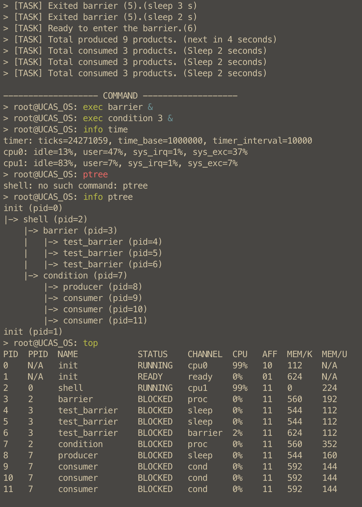

# UCAS-OS-Lab

## P1

C-Core

---

## P2

C-Core

### Launch:

```
./configure
make
make run
# or make debug
```

---

## P3

C-Core

### Launch:

```
./configure
make

# single core
make run # or debug

# multi core
make run-smp # or debug-smp
```

### Features:

- 使用大内核锁

- 调度时将 `current_running(tp)` 存在 `sscratch` 中。

- 将 `lock.c` 迁移到 `lock.cpp`，从而可以使用 C++ 的 RAII 机制，自动管理锁的获取与释放。

   ```
   {
      with_spin guard(&some_spinlock);
      ...
   }
   ```

   这样自动管理的好处是控制流比较复杂时（例如中途有 return, break 等），也能保证锁的正确释放，避免死锁。

- shell 功能：

  - 支持含有语义的高亮，正确/错误命令分别以不同颜色显示

  - 支持 tab 自动补全

  - 支持 Ctrl-W, Ctrl-U 删除

  - 支持 Ctrl-N, Ctrl-P 切换保存的上一条命令

  - 自动滚屏，高度可以运行时设置

  - 所有命令：

   ```
   > root@UCAS_OS: help
   usage: command [subcmd ...]
   echo:       echo
   ts:         show task
   ps:         show process
   exec:       execute program
   kill:       kill process
   clear:      clear screen
   taskset:    set task affinity
   top:        show top processes
   info:       show system info
   set_height: set shell height
   nice:       set scheduling nice value
   help:       show help information
   exit:       exit shell
   ```

  - `ps` 显示 process id, parent process id, name, status, channel, CPU 占用百分比，CPU 亲和性，内存占用量，nice 值等信息

   ```
   > root@UCAS_OS: top
   PID  PPID  NAME            STATUS    CHANNEL  CPU   AFF  MEM/K  MEM/U  NI
   0    N/A   init            READY     ready    0%    10   624    N/A    0
   1    N/A   init            READY     ready    0%    01   624    N/A    0
   2    0     shell           RUNNING   cpu0     16%   11   0      224    20
   3    2     mbox_exchange   BLOCKED   proc     0%    11   560    96     0
   4    3     proc0           BLOCKED   proc     0%    11   560    80     0
   5    3     proc1           BLOCKED   proc     0%    11   560    80     0
   6    4     p0-recv         READY     ready    47%   11   608    64     0
   7    4     p0-send         READY     ready    47%   11   512    64     0
   8    5     p1-recv         RUNNING   cpu1     44%   11   0      64     0
   9    5     p1-send         READY     ready    46%   11   704    64     0
   ```

     channel 分为 ready, cpuX, proc, mutex, cond, sema, bar，分别表示就绪队列、在 cpuX 上运行、等待其他进程、等待互斥锁、等待条件变量、等待信号量、等待屏障。

  - `top` 命令会自动循环执行 `ps` 直到按下任意键

  - `info` 命令支持查看多种系统信息:

   ```
   > root@UCAS_OS: info help
   usage: info [subcmd ...]
   task:      display runnable tasks
   proc:      display current processes
   ptree:     display process tree
   pcb:       display pcb array
   time:      display timer and cputime
   cond:      display condition status
   mutex:     display mutex status
   bar:       display barrier status
   sema:      display semaphore status
   sync:      display all synchronization machanics
   mbox:      display mailbox status
   help:      display this help message
   ```

   例如：
   ```
   > root@UCAS_OS: info sync
   mutex 0: key=42, ref=0x18, acquired=0, pid=11
   condition 0: key=58, ref=0x18, waiting_count=3
   ```

   ```
   > root@UCAS_OS: info ptree
   init (pid=0)
   |-> shell (pid=2)
      |-> condition (pid=13)
      |   |-> producer (pid=14)
      |   |-> consumer (pid=15)
      |   |-> consumer (pid=16)
      |   |-> consumer (pid=17)
      |-> barrier (pid=18)
         |-> test_barrier (pid=19)
         |-> test_barrier (pid=20)
         |-> test_barrier (pid=21)
   init (pid=1)
   ```

   ```
   > root@UCAS_OS: exec mbox_exchange &
   > root@UCAS_OS: info time
   timer: ticks=69005630, time_base=10000000, timer_interval=25000
   cpu0: sys=19731346(37%), user=32627072(62%), idle=0(0%)
   cpu1: sys=7477614(14%), user=6050073(11%), idle=38825224(74%)
   > root@UCAS_OS: info time
   timer: ticks=115351076, time_base=10000000, timer_interval=25000
   cpu0: sys=89264343(77%), user=26086699(22%), idle=0(0%)
   cpu1: sys=21193853(45%), user=25119890(54%), idle=0(0%)
   ```

  - `kill` 命令会结束进程树，并回收所有资源（包括 mutex, cond, barrier, semaphore, mailbox 等）

  - `nice` 命令可以调整当前进程优先级 (非负整数)，值越高优先级越低



## P4

C-Core

```
# compile
./configure
make

# run
make run-smp # or debug-smp
```


[Design Document](docs/p4/design.md)

### Features

#### 虚拟内存与页表体系

- **SV39 启动与多核复位**：两阶段启动：
  1. 主核 boot，进入 `init/main.c:main()` 完成 `init_jmptab()` 后通知其他核 boot，等待其他所有核启动到进入 `init/main.c:main()` 后清理 boot 页表 `reset_boot_vm()`
  2. 主核继续进行其他的初始化，从核等待初始化完成。
- **页表管理 API**：`kernel/mm/mm.c` 提供 `alloc_page()`、`bind_page()`、`uva2kva()`、`cleanup_vm()` 等函数，配合 `share_pgtable()` 实现「用户态私有 + 内核共享」的页表层级管理。
- **页框分配与追踪**：每个物理页在 `pageframe_t` 中记录其挂接的 `PTE*`，通过 `pageframe_kva2attr()`、`pageframe_destruct()` 在释放时回收；`alloc_pageframe()` 会在分配前调用 `shrink_pagegroup()` 触发必要的换页操作。

#### 页帧组与置换算法

- **配额化的 pageframe_group**：`include/os/mm.h` 定义的 `pageframe_group_t` 让每个地址空间拥有独立容量、引用计数与页链表，支持 `fork_pagegroup()`、`resize_pagegroup()` 与 `free_pagegroup()` 以运行时调整额度。
- **可插拔置换策略**：`kernel/mm/pf_evict.cpp` 实现 FIFO、Second-Chance、LRU 三种 `pagegroup_vtable`。通过 `sys_set_page_repl_algo()`（见 `kernel/syscall/syscall.c`）可在运行中切换算法，`handle_irq_timer()`/`handle_page_fault()` 负责调用 `on_timer`、`on_access`、`on_write` 钩子维护状态。
- **运维指令**：`show_pagegroups()`（`kernel/mm/pagegroup.cpp`）接入 shell 的 `info page` 子命令，配合 `tui::display_table` 输出每个组的容量、占用、算法等细节，便于调优。

#### 交换区与缺页处理

- **64 MiB 交换空间**：`kernel/mm/swap.c` 将镜像中的 `swap_base_location` 暴露给内核，最多管理 `NUM_MAX_SWAP = 64MiB / 4KiB` 个槽位，`swap_using[]` + `swap_used`/`swap_next_idx` 负责分配策略。
- **换入换出流程**：`swapout()` 通过组的 `evict()` 选出叶子页，使用 `bios_sd_write()` 落盘并把 PTE 转成 `_PAGE_SOFT` 状态；`swapin()` 则在缺页时 `bios_sd_read()` 回内存并重新 `bind_page()`。
- **缺页处理路径**：`handle_page_fault()`（`kernel/irq/irq.c`）先尝试懒分配，再判断 `_PAGE_SOFT` 触发 `swapin()`，同时对命中页调用 `on_access/on_write` 收集热度信息。
- **可观察性**：`show_swap()` 集成到 `info swap`，实时展示容量、已用交换槽以及换入/换出次数，方便实验分析。

#### 内核动态内存与 UVA 工具

- **Buddy `kmalloc`**：`kernel/mm/kmalloc.c` 预留 4 MiB，提供 16 B 起步、最大 4 MiB 的伙伴分配器，解决 Pipe、IPC 等场景的临时对象申请问题。
- **`uva_object_t` 自动触页**：`include/os/mm.hpp` 提供模板化封装，发送/接收（例如 `kernel/locking/mailbox.cpp`）时统一通过 `alloc_page()` + `uva2kva()` 保障跨缺页/换页访问安全。

#### Zero-copy Pipe

- **按页转移的数据通道**：`kernel/mm/pipe.c` 维护 `PIPE_MAX_COUNT=32` 个 `pipe_entry_t`。写端通过 `pipe_give_pages()` 把自身页或 swap 记录拆成 `pipe_segment_t` 放入段链表；读端调用 `pipe_take_pages()` 直接把段挂到目标页表，实现零拷贝传输信息。
- **与虚拟内存深度融合**：每个段记录 `pipe_segment_type_t`（物理/交换），在消费者侧若需要会重新 `attach_pageframe()` 或仅搬运 `_PAGE_SOFT` 元数据；`cleanup_pipe()` 由调度器在进程退出时回收引用，避免句柄泄露。
- **Syscall & 用户 API**：`sys_pipe_open/give_pages/take_pages` 同步暴露在 `tiny_libc/include/unistd.h`，`test/test_project4/pipe.c`、`ipc.c` 提供单进程与跨进程的验证样例。

#### Shell 与观测工具

- **新命令**：`test/shell.c` 新增 `free`（`sys_get_free_memory()`）、`time`（基于 `sys_get_tick()`）、`watch`（周期刷新命令输出）等工具，支持运行期观察内存水位和命令耗时。
- **信息面板扩展**：`info page`、`info swap` 等子命令覆盖新模块；`ps`/`top` 显示每个进程的栈内存占用与 NICE 值。
- **计时原语**：`sys_get_proc_tick()`（`kernel/syscall/syscall.c`）暴露 per-process tick 计数，`test/test_project4/swap.c` 用它来衡量不同置换策略的缺页代价。

#### 测试覆盖

`test/test_project4/` 下提供针对性 workload：

- `swap.c`：可切换 `lru/fifo/sc` 算法，统计缺页次数与用时。
- `pipe.c`、`ipc.c`：验证零拷贝 pipe 的自测与性能差异，并与 mailbox 进行吞吐对比。
- `oom.c`：通过 `sys_set_max_memory()` 人为收紧配额，测试页框组不足以放下页目录时操作系统是否能杀死进程。

## P5

A-Core

```
# compile
./configure
make

# run
make run-net # or debug-net
```

### Features and Implementation 

与任务书一致，没有自由发挥内容

---

## P6

C-Core

```
# compile
./configure
make

# run
make run-smp # or debug-smp
```

### Features

#### 三层缓存架构

- **Page Cache 层**：`kernel/fs/cache.c` 实现 32 MiB（8K 页）的页缓存，通过独立的页表 `cache_pgdir` 与页框组 `fs_cache_group` 管理。支持 Write-Back 和 Write-Through 两种策略，通过 `cache_swapin()` 将扇区映射到虚拟地址空间，利用 P4 的虚拟内存系统实现换页。后台守护进程 `cache_routine()` 定期触发 `flush_filesystem()` 写回脏页。
- **Block Cache 层**：`kernel/fs/block.c` 维护 8 个并发块缓冲区，每个 `block_t` 包含 4 KiB 数据与引用计数。`block_open()` 实现 LRU 风格的替换：命中时增加引用计数，未命中时选择空闲或引用计数为 0 的槽位，必要时先写回旧块。`block_alloc()`/`block_free()` 通过位图管理数据块分配，支持直接访问块映射表。
- **Inode Cache 层**：`kernel/fs/inode.c` 提供 64 个 inode 缓存槽位，每个 `inode_t` 维护引用计数 `ref_count` 与文件系统引用 `link_count`。`inode_open()` 加锁并懒加载磁盘 inode，`inode_sync()` 写回元数据。支持直接块（10 个）、间接块（1024 个）、双重间接块（1024×1024 个）的三级索引结构，`inode_mapblock()` 按需分配数据块。

#### Dentry Cache

- **哈希表实现**：`kernel/fs/dcache.c` 使用 256 个哈希桶的链式哈希表，基于 `(parent_inode, filename)` 的 FNV-1a 哈希。`dcache_get()` 在 `dir_lookup()` 前先查询缓存，命中时直接返回 inode 号与目录偏移；`dcache_put()` 在遍历目录时自动填充缓存；`dcache_remove()`/`dcache_invalidate()` 在删除文件或目录时失效相关条目。
- **与目录操作集成**：`kernel/fs/dir.c` 的 `dir_lookup()` 优先查询 dentry cache，未命中时遍历目录并缓存所有遇到的条目，加速后续查找。`dir_link()`/`dir_unlink()`/`dir_rmdir()` 同步更新缓存状态，保证一致性。

#### 文件系统操作

- **路径解析**：`path_resolve()` 支持绝对路径与相对路径，通过 `path_shift()` 逐级解析组件，利用 dentry cache 加速目录查找。`path_create()`/`path_remove()` 提供创建与删除的统一接口。
- **文件读写**：`inode_read()`/`inode_write()` 按块对齐处理，支持跨页表的数据传输（`memcpy_kva2uva`/`memcpy_uva2kva`），自动处理文件边界与块分配。
- **同步机制**：`flush_filesystem()` 依次写回 superblock、block cache 与 page cache，`shutdown_fs()` 在系统关闭时确保数据持久化。

#### 可配置性与测试

- **运行时配置**：通过 `/proc/sys/vm` 接口可调整 page cache 策略（write-back/write-through）与写回频率；通过 `/proc/sys/fs/dentry` 可启用/禁用 dentry cache。
- **性能测试**：`test/test_project6/test_cache.c` 对比 write-back 与 write-through 策略的读写性能；`test/test_project6/test_dcache.c` 测试 dentry cache 对大量文件随机访问的加速效果；`test/test_project6/largefile.c`、`rwfile.c` 验证大文件与并发读写场景。